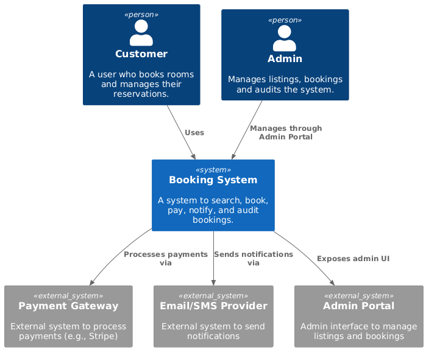
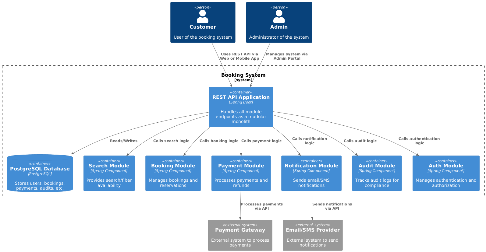
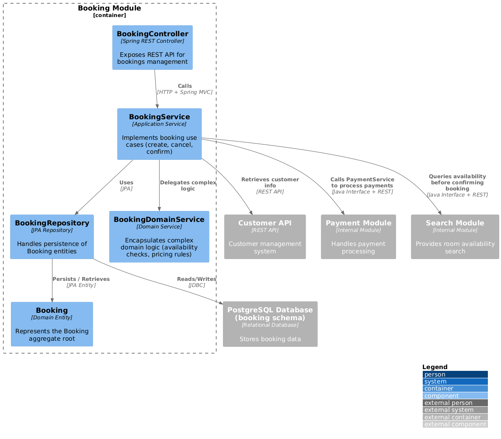

# 🏨 Booking System

## 📖 Table of Contents

1. [Overview](#overview)
2. [C4 Architecture Diagrams](#c4-architecture-diagrams)

    * [System Context Diagram](#1-system-context-diagram)
    * [Container Diagram](#2-container-diagram)
    * [Component Diagram (Booking Module)](#3-component-diagram-booking-module)
3. [Module Structure](#module-structure)
4. [Technical Stack](#technical-stack)
5. [Development Guidelines](#development-guidelines)
6. [Deployment](#deployment)
7. [Future Evolution](#future-evolution)

---

## 🧾 Overview

The Booking System is a **modular monolith** designed using Domain-Driven Design (DDD) principles and structured according to the C4 model. It provides comprehensive booking management capabilities while maintaining clear boundaries between functional domains.

**Key Features:**

* Customer booking management
* Real-time availability search
* Payment processing integration
* Notification system (email/SMS)
* Administrative functions and auditing
* Authentication and authorization

---

## 🧭 C4 Architecture Diagrams

### 1. System Context Diagram

This diagram provides a high-level overview of the system, its users, and external systems it interacts with.



### 2. Container Diagram

This diagram illustrates the high-level technology components (containers) of the system.



### 3. Component Diagram (Booking Module)

This diagram delves into the internal structure of the Booking module, showcasing its components and their interactions.



---

## 🧩 Module Structure

The project follows a modular structure to encapsulate different functionalities:

```
booking-system/
├── src/
│   ├── main/
│   │   ├── java/
│   │   │   └── com/
│   │   │       └── bookingsystem/
│   │   │           ├── core/               # Shared components
│   │   │           │   ├── exceptions/     # Shared exceptions
│   │   │           │   ├── utils/          # Shared utilities
│   │   │           │   └── config/         # Shared configurations
│   │   │           ├── search/             # Search module
│   │   │           │   ├── models/         # Domain models
│   │   │           │   ├── service/        # Business logic
│   │   │           │   ├── controller/     # REST controllers
│   │   │           │   └── config/         # Module configurations
│   │   │           ├── booking/            # Booking module
│   │   │           │   ├── models/
│   │   │           │   ├── service/
│   │   │           │   ├── controller/
│   │   │           │   └── config/
│   │   │           ├── payment/            # Payment module
│   │   │           │   ├── models/
│   │   │           │   ├── service/
│   │   │           │   ├── controller/
│   │   │           │   └── config/
│   │   │           ├── notification/       # Notification module
│   │   │           │   ├── models/
│   │   │           │   ├── service/
│   │   │           │   ├── controller/
│   │   │           │   └── config/
│   │   │           ├── audit/              # Audit module
│   │   │           │   ├── models/
│   │   │           │   ├── service/
│   │   │           │   ├── controller/
│   │   │           │   └── config/
│   │   │           ├── auth/               # Authentication module
│   │   │           │   ├── models/
│   │   │           │   ├── service/
│   │   │           │   ├── controller/
│   │   │           │   └── config/
│   │   │           └── BookingSystemApplication.java  # Main application class
│   └── resources/
│       ├── application.properties
│       ├── application-search.properties
│       ├── application-booking.properties
│       ├── application-payment.properties
│       ├── application-notification.properties
│       ├── application-audit.properties
│       └── application-auth.properties
├── pom.xml                                  # Maven build file
├── docker-compose.yml                       # Docker Compose configuration
└── README.md                                # Project documentation
```

---

## ⚙️ Technical Stack

* **Framework:** Spring Boot 3.x
* **Database:** PostgreSQL 15
* **Build Tool:** Maven
* **Testing:** JUnit 5, Testcontainers
* **API Documentation:** SpringDoc OpenAPI

**Database Strategy:**

Utilizes a **schema-per-module** approach:

```sql
CREATE SCHEMA booking;
CREATE SCHEMA payment;
CREATE SCHEMA notification;
```

Each module manages its own database migrations via Flyway:

```
resources/
└── db/
    └── migration/
        ├── booking/
        │   ├── V1__Initial_schema.sql
        │   └── V2__Add_cancellation_policy.sql
        └── payment/
            └── V1__Initial_schema.sql
```

**Module Communication:**

Modules interact through well-defined interfaces:

```java
// Preferred - Using application service
public class BookingService {
    private final PaymentService paymentService;
    
    @Transactional
    public BookingResult confirmBooking(ConfirmBookingCommand command) {
        // ...
        PaymentResult payment = paymentService.processPayment(
            new ProcessPaymentCommand(booking.getTotal(), booking.getCurrency()));
        // ...
    }
}

// Discouraged - Direct repository access
public class BookingService {
    @Autowired
    private PaymentRepository paymentRepository; // Violates module boundaries!
}
```

---

## 📝 Development Guidelines

**Code Organization Principles:**

1. **Module Independence:**

    * Each module should be independently testable.
    * No direct database access between modules.
    * Shared code resides in the `core/` package.

2. **Dependency Direction:**

   ```
   interface → application → domain ← infrastructure
   ```

3. **Testing Strategy:**

    * **Domain:** Pure unit tests.
    * **Application:** Integration tests with mocked dependencies.
    * **Interface:** Spring MVC test slices.

**Branching Strategy:**

Utilizes Git Flow with the following branch conventions:

* `feature/module/[module-name]/[feature]` for module-specific features.
* `refactor/module/[module-name]` for architectural changes.

---

## 🔮 Future Evolution

**Migration Path to Microservices:**

1. **Phase 1:** Modular Monolith

    * All modules in one codebase.
    * Shared database with schema separation.

2. **Phase 2:** Hybrid

    * Extract payment module as a standalone service.
    * Use in-process events for communication.

3. **Phase 3:** Full Microservices

    * Each module becomes an independent service.
    * Implement API Gateway.

**Performance Considerations:**

* **Module Isolation:** Configure Hibernate to use separate cache regions.
* **Database Scaling:** Implement read replicas for the search module.
* **Monitoring:** Collect per-module metrics.

---

This architecture strikes a balance between simplicity and modularity, facilitating rapid development while providing a clear pathway for future scalability. The C4 model documentation ensures all stakeholders have a clear understanding of the system at the appropriate level of abstraction.

---

**Note:** To visualize the C4 diagrams, ensure that the corresponding images (`system-context.png`, `container.png`, `booking-component.png`) are generated using PlantUML or a similar tool and placed in the `docs/diagrams/` directory.

---
